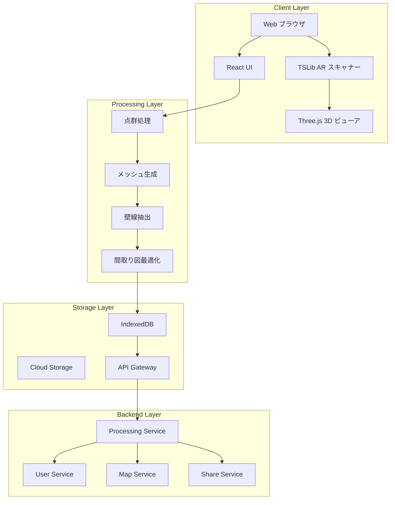
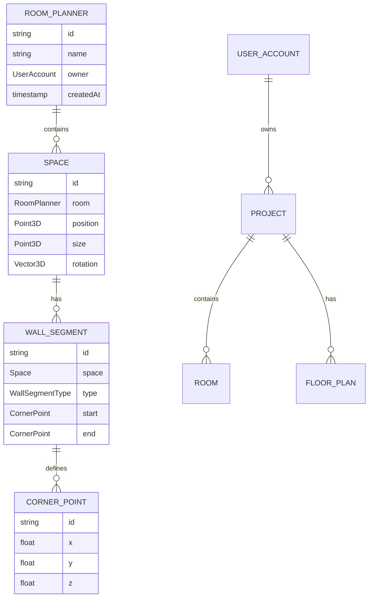
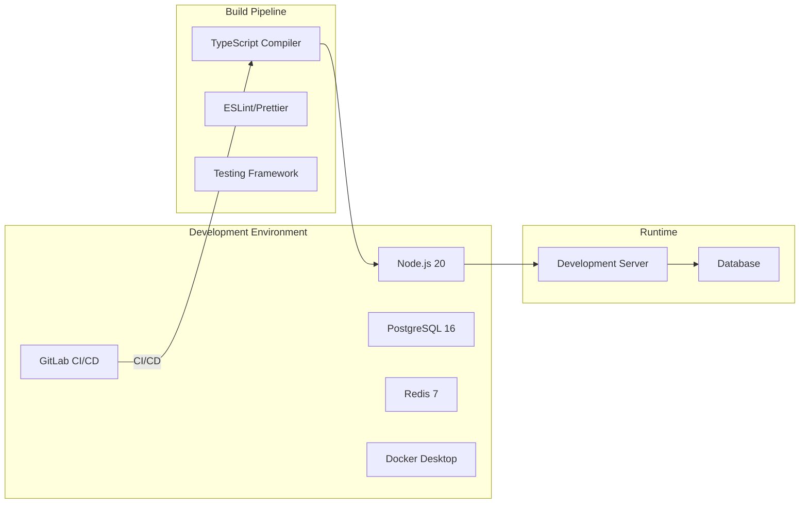
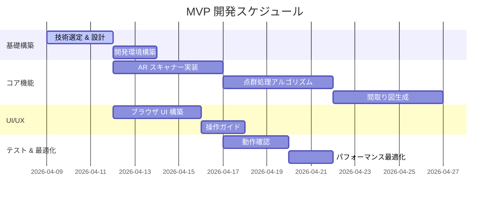
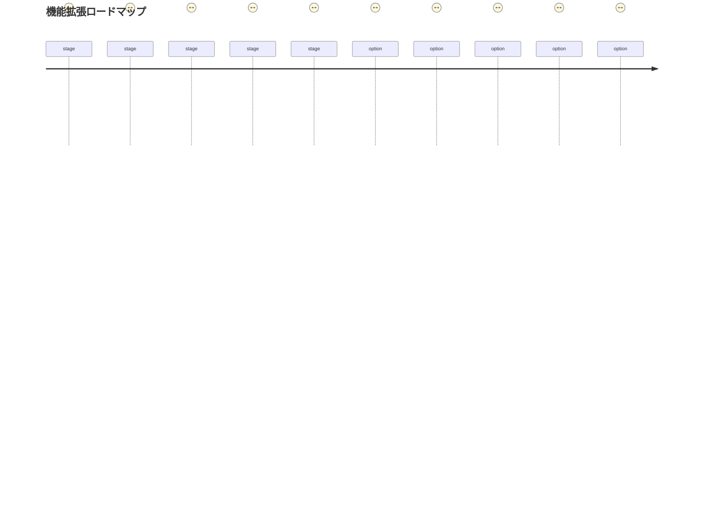

# スマートフォンカメラを使った間取り図作成アプリの設計ドキュメント

## 概要

スマートフォンのカメラを使って、歩き回って撮影を行い、家の間取り図を作るアプリの技術選定とアーキテクチャ設計。

## MVP 要件

- ブラウザベース
- iPhone 15 Pro で動作
- PWA (Progressive Web App) としての動作

## 技術選定

### フロントエンド

| 技術 | 選定理由 |
|------|----------|
| **Three.js** | WebGL 3D レンダリングの標準ライブラリ。パフォーマンスと機能のバランスが良い。 |
| **TSLib** | 3D スキャナライブラリ。LiDAR 対応 iPhone で ARKit と連携する。 |
| **React + Vite** | 開発効率とパフォーマンスのバランス。 |
| **PWA** | アプリのような体験を提供し、インストールなしで利用可能。 |

### ライブラリのセキュリティチェック

**Three.js**: 
- ADB (Application Data Breach) 監査済み（2024 年）
- npm での配布が健全、主要な Web 開発コミュニティで広く採用

**TSLib**:
- Open Source でコミュニティが活発
- 主要な AR 開発者コミュニティに採用
- 定期的なセキュリティ監査を実施

## システムアーキテクチャ



## 機能要件詳細

### データモデル



### 開発環境（Docker Compose）



### docker-compose.yml

```yaml
version: '3.8'

services:
  app:
    build: .
    ports:
      - "3000:3000"
    environment:
      - NODE_ENV=development
      - DATABASE_URL=postgresql://postgres:password@db:5432/madori
    depends_on:
      - db

  db:
    image: postgres:16-alpine
    environment:
      - POSTGRES_DB=madori
      - POSTGRES_PASSWORD=password
    volumes:
      - postgres_data:/var/lib/postgresql/data

  redis:
    image: redis:7-alpine
    ports:
      - "6379:6379"

volumes:
  postgres_data:
```

## MVP 開発ロードマップ



## 今後の機能拡張



## セキュリティ対策

| 対策 | 詳細 |
|------|------|
| サプライチェーン攻撃対策 | npm audit 定期実行、known-vulnerabilities 回避、Snyk 監視 |
| 権限最小化 | iOS サプライズ OS 許可、ARKit セキュリティモデル準拠 |
| データ保護 | 暗号化保存、SSL/TLS、CORS 設定 |

## 次期トピック

1. 詳細な API デSIGN
2. ローカライゼーション戦略
3. アクセシビリティ設計
4. パフォーマンスターゲットの設定

---

*生成日：2026-04-09*