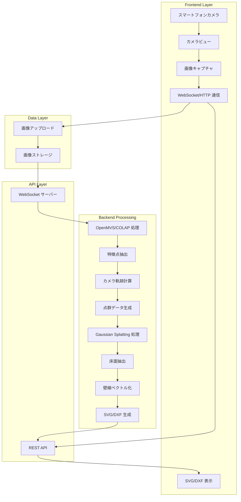

# システムアーキテクチャ設計ドキュメント

## システム全体アーキテクチャ



## フロントエンドの役割

| 機能 | 実装 |
|------|------|
| 映像取得 | `getUserMedia` API |
| キャプチャ | 数秒おき、または移動距離検知で JPEG 撮影 |
| 通信 | WebSocket または HTTP/2 で逐次アップロード |
| 表示 | 生成された SVG/DXF を描画 |

## サーバー側の役割

| 処理 | 技術 |
|------|------|
| 特徴点抽出 | OpenMVS / COLAP |
| カメラ軌跡計算 | COLAP SfM モジュール |
| 点群データ生成 | COLAP 最適化結果 |
| 空間再現 | Gaussian Splatting |
| 床面抽出 | 点群から Z 一定面を抽出 |
| 壁線ベクトル化 | RANSAC 直線フィッティング |
| 出力形式 | SVG, DXF |

## データフロー

### 1. キャプチャフロー

```
カメラ → getUserMedia → 動画ストリーム
                              ↓
                         移動検知/タイマー
                              ↓
                         JPEG 圧縮
                              ↓
                         WebSocket/HTTP
                              ↓
                         サーバーアップロード
```

### 2. 処理フロー

```
画像群 → OpenMVS/COLAP → 特徴点抽出
                          ↓
                     カメラ軌跡最適化
                          ↓
                     3D 点群生成
                          ↓
                Gaussian Splatting 処理
                          ↓
                     床面平面検出
                          ↓
                     壁線抽出・ベクトル化
                          ↓
                     SVG/DXF 出力
```

## 技術選定理由

### フロントエンド

- **getUserMedia**: ブラウザ標準 API、クロスプラットフォーム
- **JPEG 圧縮**: 通信効率と画質のバランス最適
- **WebSocket**: 低レイテンシでリアルタイムアップロード

### サーバー

- **OpenMVS**: 高精度 3D 再構築、学術的検証済み
- **COLMAP**: 高速 SfM、オープンソース
- **Gaussian Splatting**: 少ない画像でも高速処理、リアルタイムレンダリング

## セキュリティ考慮事項

- 画像データは転送中に TLS で暗号化
- サーバー側は必要最小限のアクセス権限
- プライバシーポリシーへの同意フロー

---

*最終更新：2026-04-17*
