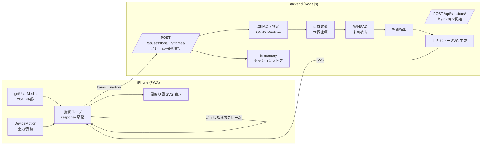

# システムアーキテクチャ設計ドキュメント

## システム概要

iPhone を片手に部屋を歩き回りながら、リアルタイムに間取り図を生成する PWA。

撮影中はカメラ映像を 1 フレームずつバックエンドへ送り、サーバ側で姿勢情報・深度推定・点群統合・平面検出を進めながら、レスポンスとして「現時点の間取り図 (SVG)」をフロントへ返却する。フロントは結果が返ってきたら次のフレームを送るレスポンス駆動ループで動く。

スケールは初期値「持ち手 150cm 仮定」で擬似的に与え、運用中に補正していく方針。設定画面による校正 UI は将来検討する。

## 全体構成



## 撮影フロー

```
[撮影開始ボタン]
    ↓
POST /api/sessions          → sessionId を取得
    ↓
[撮影ループ]
    1. getUserMedia から 1 フレームを JPEG で取得
    2. DeviceMotion から重力・姿勢のスナップショットを取得
    3. multipart で POST /api/sessions/:id/frames
    4. レスポンスの SVG を間取り図表示エリアに反映
    5. 1 へ戻る (固定間隔ではなくレスポンス完了駆動)
    ↓
[撮影終了ボタン]
    ↓
DELETE /api/sessions/:id    → 最終結果を確定
```

## バックエンド処理パイプライン

各フレーム到着時に以下を実行する。1 フレームの処理時間目標は 1 秒未満。

| 段階 | 処理 | 実装方針 |
|------|------|---------|
| 1. 受信 | フレーム JPEG + DeviceMotion JSON を multipart で受信 | multer (memoryStorage) + Express |
| 2. 前処理 | EXIF 回転、長辺リサイズ、JPEG 統一 | Sharp (#9 で実装済) |
| 3. 姿勢抽出 | 重力ベクトルから世界座標系への回転行列を構築 | フロント側で計算結果を渡す or backend で組み立て |
| 4. 深度推定 | 単眼深度推定モデルで深度マップを生成 | ONNX Runtime + 軽量モデル (Depth Anything 等) |
| 5. 点群化 | 深度マップとカメラ姿勢から世界座標の点群を生成 | カメラ intrinsics は機種推定 + デフォルト |
| 6. 累積 | 既存セッションの累積点群に追加 | セッションストア内 |
| 7. 平面検出 | RANSAC で床面を検出 (法線が重力方向のもの) | 軽量実装 |
| 8. 壁線抽出 | 床面に直交する平面を検出し、エッジを 2D ポリラインへ | 軽量実装 |
| 9. SVG 生成 | 累積壁線を上面ビューでレンダリング | テンプレート |
| 10. レスポンス | SVG + 進捗 (フレーム数、累積点数等) を返却 | JSON で SVG を埋め込み |

## 疑似スケールの扱い

絶対スケールは単眼カメラでは原理的に決まらないため、以下を組み合わせて疑似的に与える。

| 手段 | 内容 | 段階 |
|------|------|------|
| 初期値 | 「持ち手の高さ = 150cm」と仮定し、深度推定の正規化に使う | 初期実装 |
| 重力方向の固定 | DeviceMotion から床法線を確定し、世界座標系を統一 | 初期実装 |
| ユーザー校正 (将来) | 撮影開始時に「最初の壁の幅」等を入力させて補正 | 設定画面と合わせて後段で実装 |

精度は ±数十 cm 程度を想定。家具配置の参考となる平面図用途であれば実用十分。測量精度は出ない。

## 姿勢追従

世界座標系は最初の有効 motion で確定する。各フレームの depth → world 変換には、そのフレームの DeviceMotion から計算した「frame camera → world」回転を使う (issue #23)。

| 入力 | 反映される姿勢 |
|------|---------------|
| `gravity` のみ | pitch / roll を毎フレーム更新。yaw は初期値固定 |
| `gravity` + `alpha` (DeviceOrientation) | 上記に加え、初期 alpha からの差分を yaw として反映 |
| 値が無効・取得失敗 | 初期 `worldOrientation` にフォールバック |

平行移動 (撮影者の歩行による位置変化) は本実装では推定しない。撮影者は同じ位置に立ったままデバイスを向ける運用を前提とする。歩行に追従するためのカメラ位置追跡は issue #26 で別途扱う。

## 技術スタック

### フロント
| 項目 | 技術 |
|------|------|
| フレームワーク | React + Vite + PWA |
| 描画 | SVG (受信した間取り図を表示)、Three.js は将来検討 |
| カメラ | getUserMedia (`facingMode: environment`) |
| 姿勢 | DeviceMotion / DeviceOrientation (iOS 13+ 許可ダイアログ必要) |
| 通信 | fetch + multipart/form-data、レスポンス駆動ループ |

### バックエンド
| 項目 | 技術 |
|------|------|
| ランタイム | Node.js + Express + tsx |
| 画像処理 | Sharp (EXIF 補正、リサイズ、JPEG 統一) |
| 深度推定 | ONNX Runtime + 軽量単眼深度モデル (候補: Depth Anything V2 small, MiDaS small) |
| 点群処理 | 自作の軽量実装 (RANSAC、平面検出、エッジ抽出) |
| セッション | 初期は in-memory、将来 Redis に置き換え |
| キュー | 不要 (レスポンス駆動のため。ただし 1 セッション内のフレーム並列処理は考慮) |

### インフラ
| 項目 | 技術 |
|------|------|
| 配信 | nginx (HTTPS 終端、`/` → frontend、`/api/` → backend) |
| 開発 | Docker Compose で frontend / backend / nginx / redis / mysql を統一起動 |

## API 設計 (予定)

### POST /api/sessions
```json
リクエスト: 空ボディ or { "options": {...} }
レスポンス 201: { "sessionId": "<uuid>", "createdAt": "..." }
```

### POST /api/sessions/:id/frames
```
Content-Type: multipart/form-data
フィールド:
  - frame    : image/jpeg (1 枚)
  - motion   : application/json
                 { gravity: [x,y,z], attitude: [...], timestamp: ... }

レスポンス 200:
  {
    "sessionId": "...",
    "frameIndex": 17,
    "totalFrames": 17,
    "svg": "<svg>...</svg>",
    "metrics": { "pointCount": 12345, "wallCount": 6 }
  }
```

### DELETE /api/sessions/:id
```
レスポンス 200: { "sessionId": "...", "totalFrames": N, "finalSvg": "..." }
```

詳細仕様は #15 で確定する。

## サブシステム別 issue マッピング

| 領域 | issue |
|------|------|
| 画像受信・検証 | #9 (実装済) |
| セッション API 設計 | #15 |
| 単眼深度推定統合 | #16 |
| DeviceMotion 取り込み + 疑似スケール | #17 |
| フロント撮影ストリーミング UI | #18 |
| 床面・壁線抽出 (RANSAC 軽量実装) | #12 |
| SVG/DXF 出力整備 | #13 |
| セッションストアの Redis 永続化 | #14 |

旧 sub-issue (#10 COLMAP / #11 OpenMVS) は real-time 方針への変更により close。将来的に「高精度モード」として再オープンする可能性は残す。

## セキュリティ・プライバシー

- 通信は TLS で暗号化 (nginx 8443/SSL)
- 撮影画像はセッション内 (`/tmp/madori/<sessionId>/`) に一時保存し、セッション終了時に破棄
- セッション ID は UUID v4 で推測困難
- カメラ・モーション利用は iOS のユーザー許可フローに従う
